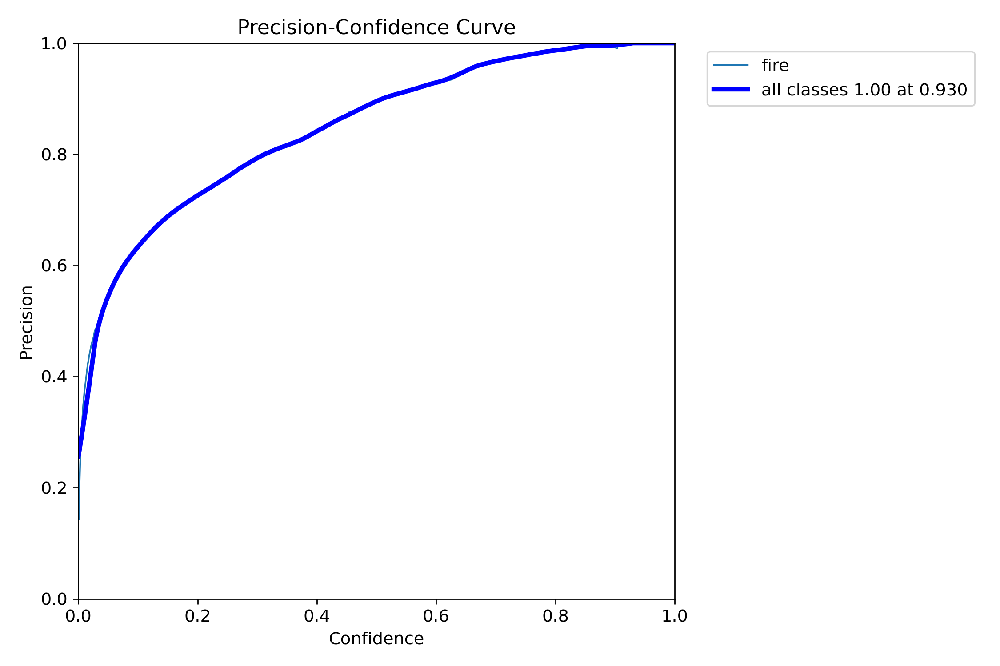
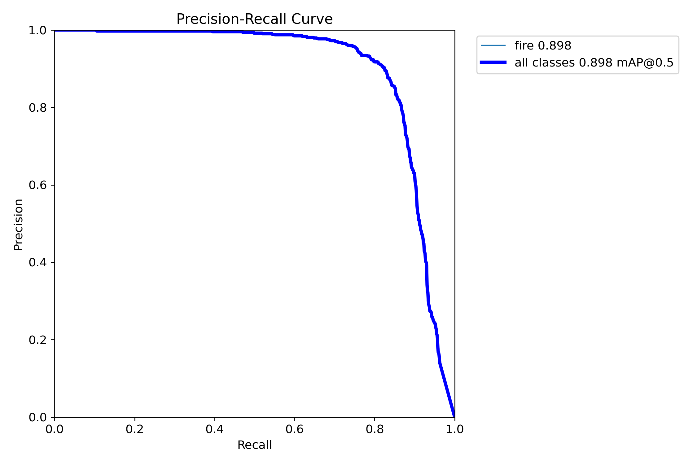
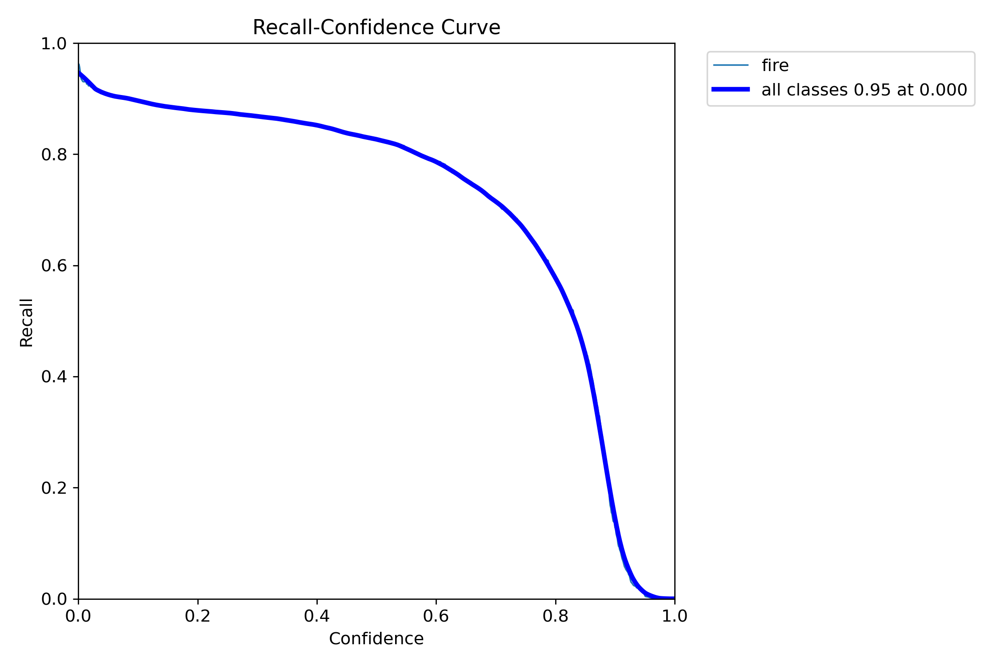
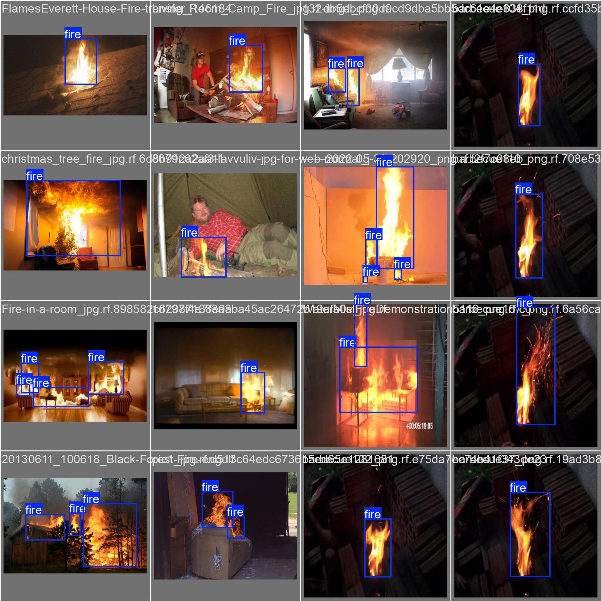
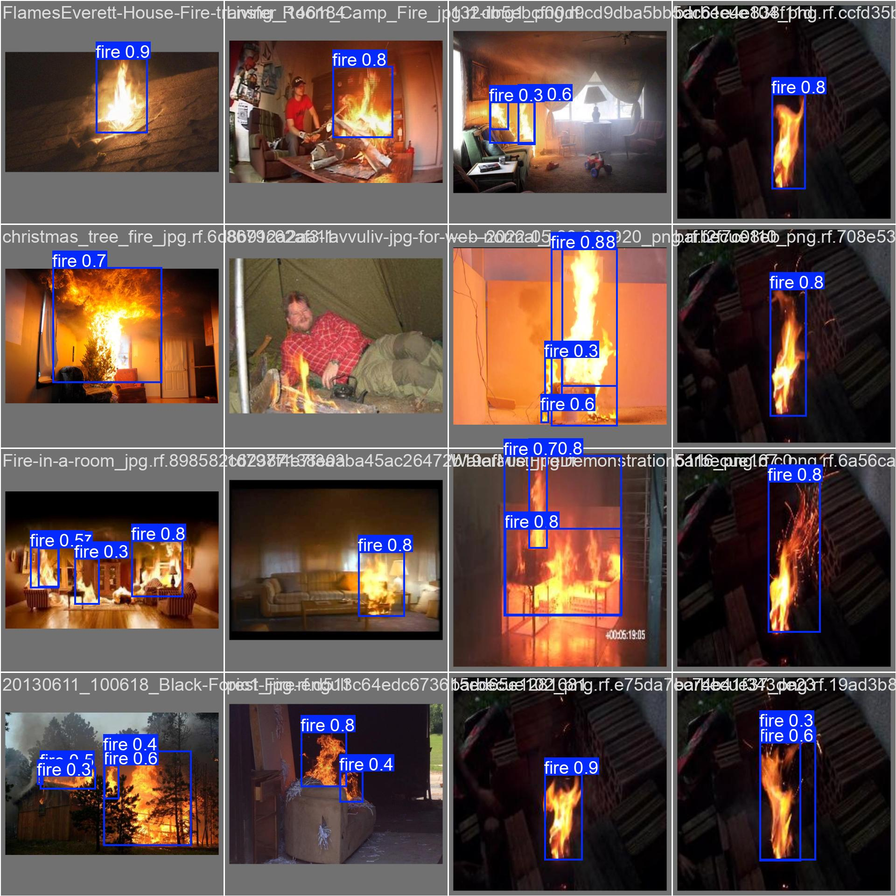
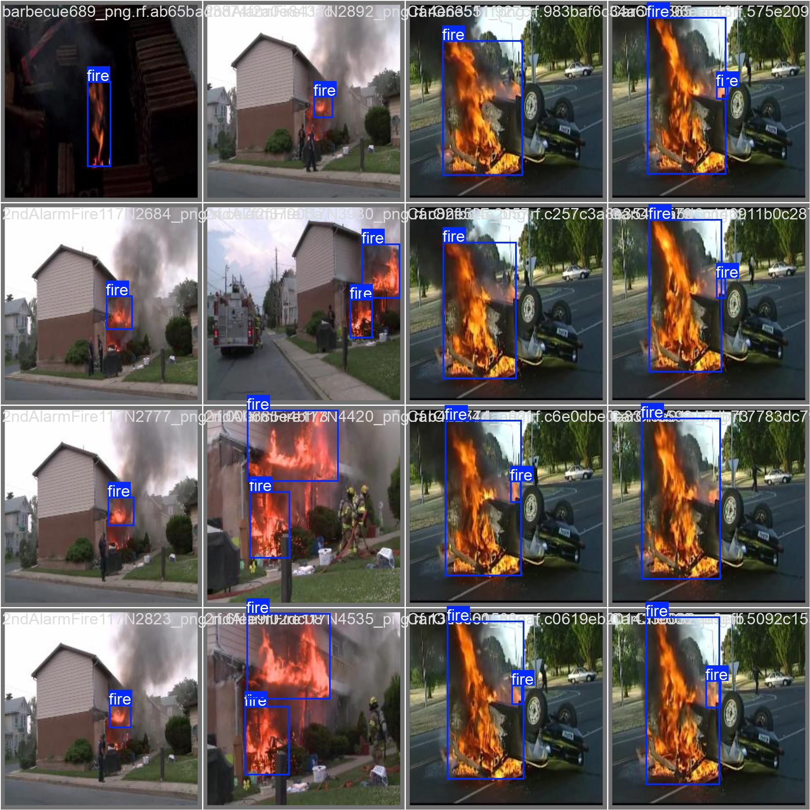
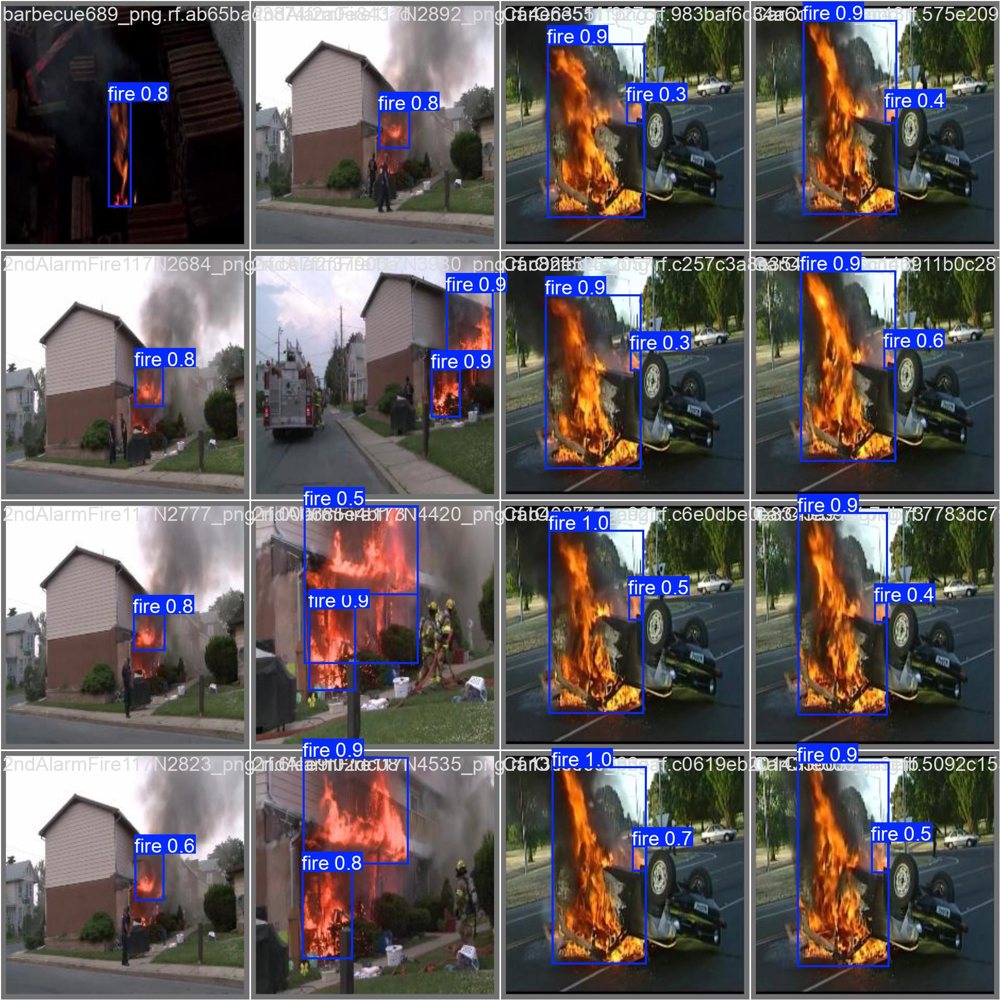
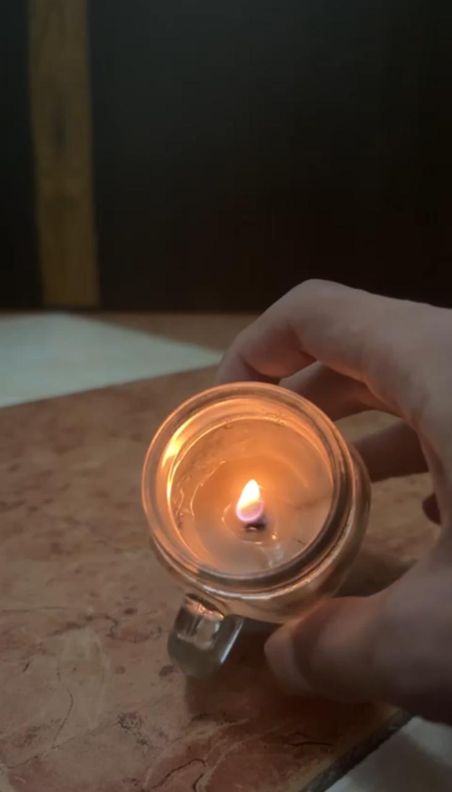
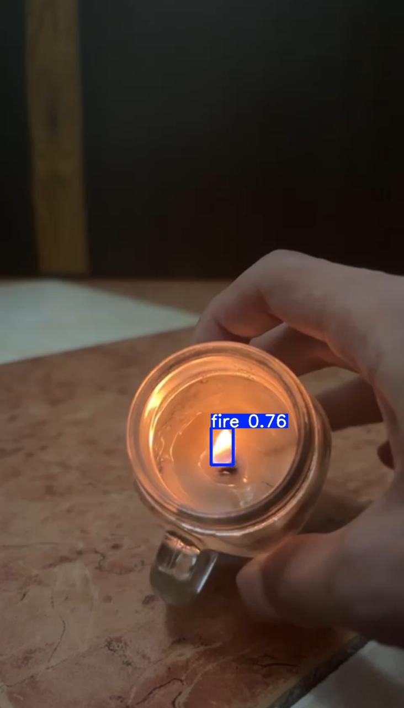

# Fire-Detection-by-yolo
YOLOv8-based fire detection project for real-time fire alerts and monitoring. Utilizes a custom-trained model for detecting fire in video feeds or images, making it suitable for safety and monitoring applications.


<h1 align="center"><span>YOLOv5/YOLOv8 for Fire Detection</span></h1>

Fire detection task aims to identify fire or flame in a video and put a bounding box around it. This repo includes a demo on how to build a fire detector using YOLOv8. 

<p align="center">
  
</p>

## First
1. Installing the packages
``` shell
# Installing the packages
!pip install ultralytics
!pip install opencv-python
!pip install ultralytics
!pip install roboflow
```

2. Import YOLO model utilities from Ultralytics and Roboflow for model use, and Image for displaying images in Jupyter
``` shell
from roboflow import Roboflow
from ultralytics import YOLO
from IPython.display import Image
```

## Connect to Roboflow with API key, access the "continuous_fire" project, and download version 6 of the dataset for YOLOv8
``` shell
from roboflow import Roboflow
rf = Roboflow(api_key="Hm8mdFJnlkZnoorR3Uy8")
project = rf.workspace("-jwzpw").project("continuous_fire")
dataset = project.version(6).download("yolov8")
```

- Train YOLOv8 model for fire detection with specified parameters (image size, epochs, batch size, and model name)
```
!yolo task=detect mode=train model=yolov8n.pt data=/content/continuous_fire-6/data.yaml imgsz=640 epochs=10 batch=10 name=fire_detection_model
```

- Validate the trained YOLOv8 model for fire detection using the best weights and specified dataset
```
!yolo task=detect mode=val model=/content/runs/detect/fire_detection_model/weights/best.pt data=/content/continuous_fire-6/data.yaml
```

## predict

- Predict from your computer camera
``` shell
model.predict(source=0, save=True,conf=0.5,show=True)
```


- Predict from your computer source

``` shell
model.predict(source=r'WhatsApp.mp4', save=False, conf=0.5, show=True)    /Replace WhatsApp.mp4 with the path of your file
```


## Results
The following charts were produced after training YOLOv8s with input size 640x640 on the fire dataset for 50 epochs.

| P Curve | PR Curve | R Curve |
| :-: | :-: | :-: |
|  |  |  |

#### Prediction Results
The fire detection results were fairly good even though the model was trained only for a few epochs. However, I observed that the trained model tends to predict red emergency light on top of police car as fire. It might be due to the fact that the training dataset contains only a few hundreds of negative samples. We may fix such problem and further improve the performance of the model by adding images with non-labeled fire objects as negative samples. 

| Ground Truth | Prediction | 
| :-: | :-: |
|  |  |
|  |  | 

#### Testing

| Input | Output | 
| :-: | :-: |
|  |  |


## 🔗 Reference
* https://github.com/ultralytics/ultralytics
* https://universe.roboflow.com/-jwzpw/continuous_fire/dataset/6
